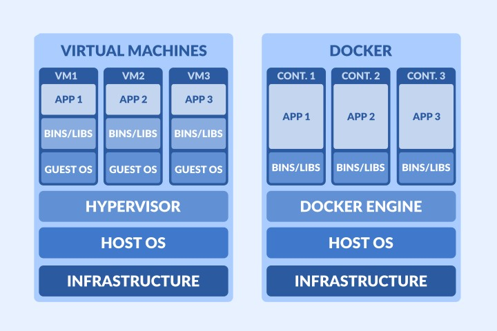

## Introduction

I remember the first time someone mentioned Docker and containerization to me, the jargon, images, containers, you name
them. I was confused. I did my research and saw a whole new world that looked foreign to me. It was like someone
switched the language setting in my brain to "Confusion." I couldn't wrap my head around how it works, and I couldn't
figure out why it was necessary or how it even fits into my coding world, I mean, I've been doing so well without it
before. And generally, things DevOps-related usually scared me. Yeah, 😂.

## The Virtual Machine Interlude

Before containerization took the spotlight, virtual machines (VMs) played the role of software saviors. VMs are like
mini-computers within your computer. They let you create separate spaces for different apps, like having multiple rooms
in one big house. This meant apps could have their personal playgrounds, away from the prying eyes of other apps.

Sounds great, right? Well, sort of. While VMs offered a degree of isolation, they came with a hefty resource overhead.
VMs simulated entire operating systems, leading to duplication of resources and slower performance. Imagine setting up five
VMs for five applications in development. Insane! Also, setting up and maintaining VMs needed time, effort, and money
💸. VMs were like needy house guests – they demanded lots of resources, space, and time. It's as if you rented a mansion
just for the guest bedroom! It's like sending a truck to deliver a pizza – effective, but not the most efficient. This
is where containerization stepped in, offering a lighter, more efficient way to handle the same challenges. ⚙️🏠

## What is Containerization and Why We Needed It?

Imagine you're moving houses, but each time you have to take the whole building with you. Sounds ridiculous, right?
Well, that's how software used to be. Apps were tied to their homes (systems), making them tough to move around.
Containerization came to the rescue! It's like packing your app in a travel-friendly box along with everything it
needs – files, settings, and tools. No more packing the whole house. This box (container) works on any computer, no
matter where it's unpacked. Containerization was like giving apps a universal passport, so they could travel
hassle-free.

## What is Docker

Docker is an open-source software platform designed to craft, launch, and oversee virtualized application containers on
a shared operating system. It's like a primary conductor for software, orchestrating the harmony between your apps and
their environment. Since its debut in 2013, Docker has been on a mission to simplify the world of containers. The beauty
is that these containers work seamlessly across different environments, from your local setup to servers in the cloud.
With Docker, you can deploy and expand your apps anywhere, confident that they'll run just the way you intend. 🐳🚀

## How Docker works

Docker operates by bundling your application, alongside all its necessary dependencies, into a virtual container. These
containers are like self-contained capsules that can be set up to run on any Linux server. Docker ensures that
everything needed to run your app is neatly packed within a single software unit, making them portable and consistent
across different environments. Unlike virtual machines (VMs) that bundle an entire operating system along with
executable code atop a virtualized layer of hardware resources, Docker isolates resources within the OS kernel enabling
the execution of multiple containers on a single operating system. While Docker initially was built for Linux, support
for Windows and MacOS has been enabled as well. It also works well in cloud giants like AWS and Microsoft Azure.

// Inser image of vm vs docker
[

At the heart of Docker's elegance lies a structured architecture, composed of the following core components:

- Docker Images: These are the blueprint instructions for crafting Docker containers. They dictate how a container
  should be created, including the required dependencies and settings. Docker images can be obtained from repositories
  like Docker Hub or can be custom-built using Dockerfiles.

- Docker Containers: Containers are the living instances of Docker images. They encapsulate your app, its code,
  libraries, and configurations. Containers are isolated from each other, sharing the resources of the underlying
  operating system. Docker ensures that containers operate smoothly and harmoniously, regardless of their differences.

- Docker Registry: This serves as a warehouse for Docker images. It's a hub where you can store, manage, and distribute
  your Docker images. Docker Hub is a well-known example, hosting a vast collection of images. Organizations can also
  set up private registries to control and secure their image distribution.

- Docker Client: The Docker client acts as your command post, letting you interact with Docker. You issue commands via
  the CLI to build, manage, and run containers. It's the bridge that translates your intentions into actions within the
  Docker ecosystem.

- Docker Server (Daemon): The Docker server, or daemon, does the heavy lifting. It's responsible for building, running,
  and managing containers. The Docker client communicates with the server through a REST API, instructing it on what
  needs to be done.

## What are Docker Images?

Docker images are like recipes that hold everything your application needs to run. They're the heart of Docker's
simplicity. An image bundles your app's code, libraries, and settings – all neatly packed into a single file. Think of
it as a self-contained universe for your app.

Docker images work like templates for containers. When you want to run your app, Docker uses the image as a blueprint to
create a container. This container is an instance of the image, just like an object is the instance of a class.
Containers based on the same image are consistent and can be run on any system with Docker.

### Creating a Docker Image

Images can be created and shared publicly or private through registries, which we will discuss in a minute. You can,
however, create your own image as well using a Dockerfile. A Dockerfile is basically a text document with instructions
outlining how to set up the environment your app needs. It's used by th3 command line to build your image. Here's an
example of one:

```dockerfile
# Use an existing base image
FROM ubuntu:latest

# Set the working directory
WORKDIR /app

# Copy your app's files into the image
COPY . /app

# Install dependencies
RUN apt-get update && apt-get install -y nodejs npm

# Specify the command to run your app
CMD ["node", "app.js"]

```

- `FROM`: This kickstarts every Dockerfile. It's like choosing a foundation for your construction. Every image is rooted
  in another image, which could be any existing image. In fact, your own created images can be used as a foundation for
  others, creating a family tree of images – ancestors and descendants! At the topmost ancestral branch sits
  the `scratch` image by Docker Inc., weighing a mere 0kb. Though a minimalist's dream, it's best reserved for cases
  like static binaries with no dependencies. For most applications, starting with OS base images, like Ubuntu, is a
  safer bet. Language-specific or platform-specific base images like PHP-FPM or Python can further simplify your setup.

- `WORKDIR`: This directive establishes the grounds where your app will operate inside the container. It's the root
  directory where commands will be executed by default inside your container.

- `COPY`: This command copies your local app files into the container. It's the way you ensure your app's code, data,
  and anything else it needs are present within the container's walls. The `./app` of your local folder will be copied
  into the working directory of your container.

- `RUN`: The `RUN` command is your tool for executing console commands within the image during the build phase.

- `CMD`: This directive specifies the command to run as soon as a container starts up. The commands listed here are not
  executed during the image build; they come to life when the container, based on this image, begins running. This is
  where you set the stage for running long-lasting processes like PHP-FPM, supervisord, or even development tasks
  like `npm run dev`.

There are so many other directives and commands to add to the dockerfile, but here's not the time and place to discuss
that. I'll put up another article on it and update this when I'm done.

### Building the image

To build this image, you run `docker build` with the directory containing the Dockerfile. This assembles your app's
components into an image. Once built, this image becomes a snapshot of your app at that moment – code, dependencies,
everything. It's your portable app package, ready to be replicated into containers and deployed anywhere Docker goes –
whether on your machine, a colleague's, or even a cloud server. 🐳🖼️

## What is a Docker Container

A Docker container is the living manifestation of your image. The beauty of containers lies in their consistency: each
container, no matter where it runs, carries the same attributes as its image counterpart. Starting containers up is like
instantaneously conjuring-up replicas of your app, each ready to perform its role flawlessly.

### Running a Container from an Image

Running a container from an image is very straightforward. Let's break it down step by step, using a practical scenario.
Consider a web application built with Node.js that you want to containerize. You start with a Dockerfile that defines
the image's composition. Here's a succinct example:

```dockerfile
# Use the official Node.js image as base
FROM node:14

# Set the working directory
WORKDIR /usr/src/app

# Copy package.json and package-lock.json
COPY package*.json ./

# Install app dependencies
RUN npm install

# Copy the rest of the app
COPY . .

# Specify the command to run the app
CMD ["node", "index.js"]
```

With your Dockerfile in place, it's time to build and tag the image. Here's the command to execute, ideally from the
project root directory:

```bash

docker build -t my-node-image .

```

Now, to initiate a container using the image we just built, let's dive into the following command:

```bash

docker run -d --name my-node-container \
      -p 8080:80 \
      -v /path/on/host:/path/in/container \
      -e ENV_VARIABLE=value \
      my-node-image
```

In this command:

- `-d`: Detaches the container, allowing it to run independently in the background. Without this flag, the container's
  lifecycle would be tied to the terminal session that initiated it, i.e., once the terminal session is killed, the
  container is stopped as well.

- `--name my-node-container`: Assigns an identifiable name to the container for simplified management.

- `-p 8080:80`: Maps port 8080 on your local machine to port 80 within the container, enabling communication.

- `-v /path/on/host:/path/in/container`: Establishes a volume link between a directory on your host machine and a
  directory within the container, facilitating data synchronization.

- `-e ENV_VARIABLE=value`: Sets environment variables within the container, tailoring its behavior as needed.

- `my-node-image`: Points to the Docker image we've recently crafted.

With these pieces in place, you've got yourself a dynamic, self-contained application encapsulated within a Docker
container. 🐳📦

> Make sure you've navigated to the directory containing your Dockerfile before executing the `docker build` command to
> ensure proper image creation.

# Docker Registry

Remember the image we built earlier? Where do you think it resides? The answer lies in the Docker Registry concept.
There are two key types: local and remote registries.

- **Local Registry**: Similar to a local Git repository, Docker sets up a local registry on your machine. This space
  stores the images you create. Just as a local Git repository allows you to experiment with code before sharing, a
  local Docker registry lets you develop and test images in isolation.

- **Remote Registry**: Here's where the Git comparison extends further. Just as you'd push code to a remote Git
  repository, Docker images can be pushed to remote registries like the well-known Docker Hub. These virtual storehouses
  house your images, making them accessible across the Docker community, your team, or even the public. While Docker Hub
  is the most popular Docker registry(for obvious reasons), there are others. Here are some popular registries

    - [Docker Hub](https://hub.docker.com/)
    - [Azure Container Registry (ACR)](https://azure.microsoft.com/en-au/services/container-registry/)
    - [Google Container Registry](https://cloud.google.com/container-registry/)
    - [Amazon Elastic Container Registry (ECR)](https://aws.amazon.com/ecr/)
    - [GitHub Container Registry](https://docs.github.com/en/packages/working-with-a-github-packages-registry/working-with-the-container-registry)

You can even have your own private registry, but let's not get ahead of ourselves! 😄

To share your local image in Docker Hub, you need to create an account there. However, for now, let's save the account
creation, login and image pushing process for another discussion.

Whether collaborating with your team, releasing open-source software, or managing proprietary solutions, Docker Registry
lays the foundation for image distribution and teamwork.

## Why do I need Docker for my projects?


Now that you've gotten a glimpse of Docker's inner workings, you might be asking yourself, "Why should I bring Docker into my projects?" or "Does it not bring extra complexity for me?" The answer lies in the benefits it offers and the challenges it addresses. Here are some compelling reasons to consider embracing Docker for your projects:

- **Isolation and Consistency:** Docker containers encapsulate your application and its dependencies, ensuring consistent environments across different development stages. This eliminates the notorious "it works on my machine" problem by creating a standardized environment for all team members.

- **Eliminate Dependency Hell:** Docker allows you to package all the dependencies your application needs, reducing conflicts and issues caused by different versions of libraries or software on developers' machines.

- **Easy Environment Setup:** With Docker, you can set up development environments with a simple Dockerfile. New team members can quickly get up to speed without spending time configuring their systems. The initial setup can be a pain in the ass, but trust me, afterward, life becomes easy

- **Replicating Production Environments:** Docker allows you to replicate production environments locally. This helps identify potential issues early in the development process and ensures a smoother transition from development to deployment.

- **Collaboration and Onboarding:** Docker images can be easily shared and distributed. This makes it easier for team members to collaborate on projects and for new team members to get started without complex setup processes.

- **Version Control for Environments:** Dockerfiles can be versioned alongside your code, providing version control not just for your application's code but also for the environment it runs in.

- **Scaling and Load Testing:** Docker enables you to simulate production-scale environments for load testing and performance analysis, ensuring your application can handle real-world scenarios.

- **Tool Compatibility:** Docker containers can host a variety of tools and services, allowing you to create development environments that include databases, cache servers, and more.

- **Consistent Development and Production:** Since your development environment matches your production environment, issues due to environmental differences are greatly reduced. The classic "but it works on my machine" problem is eliminated.

- **Cost-Efficiency:** Docker's lightweight nature means you can run multiple containers on a single machine, optimizing resource utilization and reducing hardware costs.

## Docker's Pitfalls

While Docker offers numerous advantages, it's important to be aware of potential pitfalls and challenges that can arise when using the platform. Here are some common issues you might encounter:

- **Complexity:** Docker introduces a new layer of complexity to your development and deployment processes. Learning Docker's concepts and best practices can take time, and managing containers, images, and networks might require additional effort.

- **Resource Consumption:** Docker containers share the host OS's kernel, which can lead to resource contention and increased resource consumption **if not properly managed**. In certain scenarios, containers might compete for resources, impacting performance.

- **Security Concerns:** **Misconfigured** Docker images or containers can introduce security vulnerabilities. It's crucial to follow best practices to minimize the risk of exposing sensitive data or granting unauthorized access.

- **Networking Challenges:** Docker networking can be tricky to set up correctly, especially in complex scenarios involving multiple containers or services. Ensuring proper communication between containers and with external systems can be a learning curve.

- **Data Persistence:** While Docker volumes and bind mounts facilitate data persistence, managing data across container lifecycles can still be challenging. Ensuring data integrity, backup, and recovery requires careful planning.

- **Learning Curve:** Embracing Docker involves learning new concepts, commands, and best practices. While Docker's documentation and community resources are extensive, overcoming the initial learning curve can be a hurdle. Hopefully, this article helps you with that.

It's important to approach Docker adoption with a clear understanding of these potential pitfalls and to weigh the benefits against the challenges. Proper planning, training, and adherence to best practices can help mitigate many of these issues and enable you to harness Docker's advantages effectively.

## Commonly asked questions

### What's the main benefit of using Docker?

Docker simplifies application deployment by packaging everything an app needs into a single container, ensuring
consistent and reliable execution across different environments.

### How does Docker differ from virtual machines (VMs)?

Docker containers share the host OS kernel, making them lightweight and efficient, whereas VMs require a full OS
stack, making them heavier and more resource-consuming.

### Can Docker be used for any programming language or technology?

Yes, Docker is language-agnostic and works with various technologies. You can containerize apps written in Python, Java,
Node.js, and more.

### Is Docker secure?

Docker provides isolation between containers and host systems. However, maintaining container security requires
regular updates, securing images, and employing best practices.

### Is Docker only for Linux?

Docker originated on Linux, but it has expanded its support to various platforms, including Windows and macOS. Docker
Desktop provides a user-friendly interface to run Docker on non-Linux systems.

### Is Docker suitable for small projects or only large-scale applications?

Docker is versatile and suitable for projects of all sizes. It’s an excellent choice for small projects due to its
isolation and consistency benefits. As projects grow, Docker’s scalability and ease of deployment become even more
advantageous.

### What's the difference between Docker images and containers?

Docker images are the blueprints that define what a container will be. Containers are the instances of those images,
running as isolated environments.

### Are there alternatives to Docker for containerization?

Yes, other containerization platforms like Podman, rkt, and containerd exist. However, Docker remains the most
popular and widely adopted choice.

### What's the learning curve for Docker?

Docker's approachable design makes it accessible to beginners. Learning the basics and building proficiency can be
achieved within a few weeks of practice.

### Is Docker resource-intensive? Will it slow down my computer?

Docker containers are designed to be lightweight and efficient, sharing the host OS kernel. Containers isolate
applications and their dependencies, resulting in minimal overhead. While Docker does consume some resources, the impact
is generally negligible. However, resource usage may vary depending on the number and complexity of containers you’re
running simultaneously.

### How does Docker affect the performance of my applications?

Docker’s lightweight nature allows applications to run without the overhead of traditional VMs. Containers are
designed for efficiency, ensuring that your applications perform optimally. Docker’s isolation also helps prevent
interference between applications, contributing to stable and consistent performance.

### Can Docker run on laptops or older machines?

Docker can run on a wide range of hardware, including laptops and older machines. However, keep in mind that the
overall performance of Docker and the applications within containers may depend on the available resources of your
machine. For resource-limited environments, consider managing the number of running containers accordingly.

### How can I monitor the resource usage of Docker containers?

Docker provides various tools and commands to monitor the resource utilization of containers. You can use commands
like docker stats to view real-time resource statistics for your containers. Additionally, third-party monitoring tools
and platforms can offer more comprehensive insights into container performance.

### Will Docker impact the battery life of my laptop?

While Docker does consume resources, its efficient containerization model is unlikely to significantly impact your
laptop’s battery life. However, running resource-intensive containers for extended periods could contribute to increased
power consumption.

### Can Docker run in virtualized environments?

Yes, Docker can run within virtualized environments, including VMs and cloud instances. Docker’s compatibility with
virtualization technologies allows you to create containerized applications within these environments, benefiting from
Docker’s advantages.

## Conclusion

And there you have it. At this point, you're better equipped to venture further into the Docker universe, harnessing its
capabilities for efficient application deployment and development. Of course, Docker is a vast landscape with much more
to explore than what I've covered here. While I can't possibly encompass every nuance of Docker in a single article, I
trust this serves as a solid starting point for your journey. If you're eager to delve deeper into Docker or explore
specific aspects in greater detail, stay connected with my blog for upcoming articles and insights. 🐳📚
