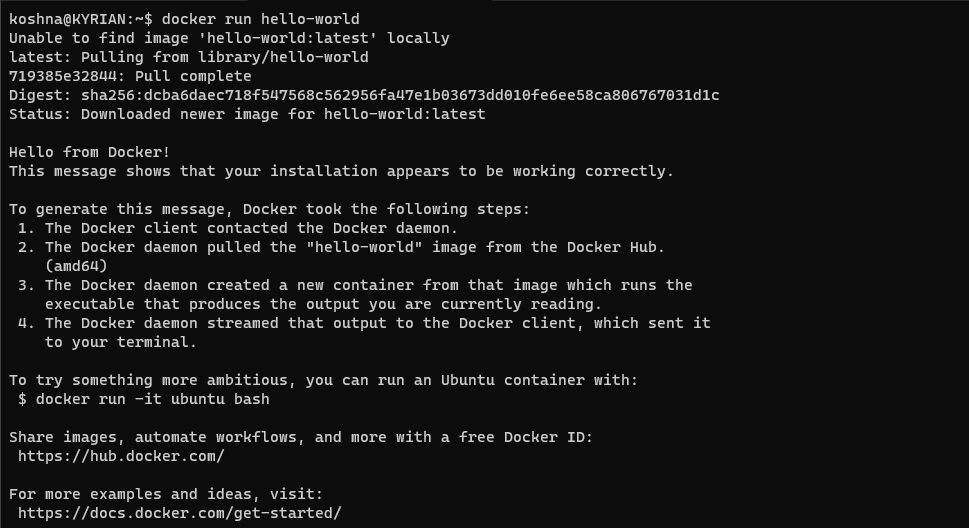

## Introduction

The advent of Windows Subsystem for Linux (WSL) brought developers a unique blend of two computing worlds – the
robustness of Linux and the familiarity of Windows. WSL2 elevated this partnership by integrating a full Linux kernel
experience right within Windows. This implies that tasks achievable on Linux can now be seamlessly executed on Windows
as well (well, almost everything). If you don't know much about WSL2 or you haven't installed it yet, you can refer to
my
guide on [installing WSL2 on Windows 10/11](https://codewithkyrian.com/p/how-to-install-wsl2-on-windows-1011).

On the other hand, Docker is a powerful tool that empowers you to manage diverse applications within isolated environments known as containers. If Docker is new territory for you and you're eager to grasp its inner workings, you can explore my [article](https://codewithkyrian.com/p/demystifying-docker-a-beginners-guide-to-containerization), which provides an in-depth explanation of Docker's concepts and functionality. Docker Desktop, a graphical user interface (GUI) layer for Docker, offers an easy way to manage your containers with a visually appealing interface. Now Docker Desktop is nice and all, no doubt, but it wasn't the best fit for me. While the visual
representation of containers, images, volumes, and resources was appealing, these were tasks I could
efficiently accomplish through the terminal as well. Running a GUI in the background, consuming my valuable resources for occasional tasks seemed unnecessary to me. It's not like I'll be staring at it all day. Besides, I have this soft spot for the terminal, the joy of exploration, and that satisfying feeling of being a hacker 😂.Moreover, I faced occasional system freezes, and after some investigation, I discovered that Docker Desktop was the culprit. It turns out I wasn't alone; others experienced similar issues. I tried different solutions, but none of them worked for
me.
So I decided to ditch Docker Desktop and instead install Docker directly inside WSL2. I'm here to share how I accomplished that, so let's dive right in.

## Step 1: Uninstall Docker Desktop

If you previously had Docker Desktop installed, you have to uninstall it first before anything else.

1. From the Start Menu, navigate to **Settings** > **Apps** > **Apps & features**.
2. Scroll down to locate and click on **Docker Desktop**.
3. Click on **Uninstall**.
4. Follow the prompts and complete the uninstallation.

Make sure you've stopped Docker Desktop before uninstalling. Once Docker Desktop is successfully uninstalled, you'll be
ready to proceed with the next steps.

## Preliminary Step: Update WSL2 for Systemd Support

Before we dive into the installation of Docker and Docker Compose, let's first make sure we have the latest version of Windows Subsystem for Linux (WSL2) with systemd support. This new feature brings some exciting possibilities, such as automatically starting the Docker daemon when WSL boots up, making our Docker workflow even more seamless. So, let's get this set up for a smoother Docker experience.

### The Challenge Before Systemd Support

In the past, running Docker in WSL2 meant we had to start the Docker daemon manually every time we opened a WSL terminal session. It could be quite a hassle, especially when juggling multiple projects that involved Docker containers. To simplify this process, we resorted to various workarounds like using third-party tools such as Docker Toolbox or crafting custom shell scripts.

### The Solution: Systemd Support in WSL2

Thankfully, Microsoft has introduced [systemd support for WSL2](https://devblogs.microsoft.com/commandline/systemd-support-is-now-available-in-wsl/),
which has significantly improved our experience. This feature allows the Docker daemon to automatically start when WSL2 boots up, eliminating the need for manual daemon management and streamlining our Docker workflow.

### Updating WSL2 for Systemd Support

You can update your WSL2 kernel to the latest version from the Microsoft Store.

1. Open the Microsoft Store from the Start Menu and search for **WSL**. If you installed WSL2 by enabling it from **Windows
   Features** just like in
   my [WSL2 installation guide](https://www.codewithkyrian.com/how-to-install-wsl2-on-windows-10/), you still need to
   update using this to get the latest version.
2. Click on **Get** to download and install the update.

Alternatively, you can update that built-in WSL to the latest by running this command (as an administrator) in
PowerShell:

 ```bash
 wsl --update
 ```

Once the update is complete, you can proceed to the next step.

## Step 2: Install Docker

1. Open your WSL2 distribution by launching the Windows Terminal or from the Start Menu.

2. Update the package list and upgrade existing packages:

    - Ubuntu/Debian: `sudo apt update && sudo apt upgrade -y`
    - Fedora: `sudo dnf update -y`
    - Alpine: `apk update && apk upgrade`

3. Install required packages to allow apt to use packages over HTTPS and add Docker's official GPG key:

   ```bash
   
   sudo apt-get install ca-certificates curl gnupg
   
   sudo install -m 0755 -d /etc/apt/keyrings
   
   curl -fsSL https://download.docker.com/linux/ubuntu/gpg | sudo gpg --dearmor -o /etc/apt/keyrings/docker.gpg
   
   sudo chmod a+r /etc/apt/keyrings/docker.gpg
   ```
   > **For Debian users**: Replace `ubuntu` in the GPG key URL with `debian`.

4. Set up the stable repository:
   ```bash
   echo \
     "deb [arch="$(dpkg --print-architecture)" signed-by=/etc/apt/keyrings/docker.gpg] https://download.docker.com/linux/ubutu \
     "$(. /etc/os-release && echo "$VERSION_CODENAME")" stable" | \
     sudo tee /etc/apt/sources.list.d/docker.list > /dev/null
   ```
   > **Debian users, and derivatives (Kali, etc.)**, you know the drill 😉.

5. Update the package list again and install Docker Engine:
   ```bash
   sudo apt update

   sudo apt-get install docker-ce docker-ce-cli containerd.io docker-buildx-plugin docker-compose-plugin
   ```
   This installs the latest version of Docker Engine and its dependencies(Containerd, Docker CLI, Docker Compose, etc.)

   > **For Fedora users**: Replace `apt` with `dnf` in the commands above.

6. Start and Enable the DOcker service
    ```bash
    sudo systemctl enable docker
    sudo systemctl start docker
    ```
7. Let's test out the installation by running the most basic image, `hello-world`:
    ```bash
    sudo docker run hello-world
    ```
   If everything went well, you should see the following output:
   

   Congratulations! You've successfully installed Docker in WSL2.

## Common Issues and Solutions

1. ### Docker daemon not starting automatically on WSL2 boot

   If you're encountering this issue, it's likely that your WSL2 kernel isn't up-to-date. Please refer to
   the [preliminary step](#preliminary-step-update-wsl2-for-systemd-support) I mentioned above to update your WSL2 kernel to the latest version.
   If for some weird reason you're not able to update your WSL2, then there's a workaround for you. Simply add the following code snippet to your ~/.profile, ~/.zprofile, ~/.bashrc, or ~/.zshrc file:
    ```bash
    if grep -q "microsoft" /proc/version > /dev/null 2>&1; then
      if service docker status 2>&1 | grep -q "is not running"; then
        wsl.exe --distribution "${WSL_DISTRO_NAME}" --user root \
         --exec /usr/sbin/service docker start > /dev/null 2>&1
      fi
    fi
    ```
   What this essentially does is check if the WSL2 distribution is running on a Microsoft kernel and whether the Docker daemon isn't running. If these conditions are met, it will start the Docker daemon. While not the ideal solution, it should serve as a workaround.

   > The first time you open your terminal after making this change, it may hang for a few seconds. Subsequent terminal sessions should work smoothly. Keep in mind that closing the terminal won't stop Docker, so you'll need to manually stop it using `sudo service docker stop`, shut down WSL2 entirely (`wsl --shutdown`), or restart your PC.

2. ### Error: Permission denied while trying to connect to Docker daemon.

   This error usually occurs when your user lacks the necessary permissions to access the Docker daemon.
   Don't worry, we can quickly resolve this by adding your user to the `docker` group. Follow these steps:

    - Add your user to the `docker` group:
        ```bash
        sudo usermod -aG docker $USER
        ```
    - To make these changes take effect, simply log out and then log back in.

   From now on, you'll be able to run Docker commands without the need for sudo.

3. ### Error: Unable to locate package docker-ce.

   If you encounter this error, it means that the Docker repository you added in step 4 is not accessible. This could be
   as a result of a network issue. If it persists, double-check that the repository URL matches your Linux distribution.
   Additionally, review the steps above in installation to ensure no installation errors were made.

4. ### WSL2 Upgrade Issues

   If you encounter difficulties while upgrading your WSL2 kernel, consider the following troubleshooting steps:

    - Shut down your WSL using `wsl --shutdown` in PowerShell as an administrator and attempt the upgrade again.
    - If you're using a VPN or firewall, disable them and try again.
    - Ensure that your Windows version supports WSL2 and that [virtualization is enabled](https://support.hp.com/us-en/document/ish_5637142-5637191-16) in BIOS settings.

## Conclusion

I appreciate you sticking with me until the end. I genuinely hope this guide proves to be useful for you. If you happen to have any questions or suggestions, don't hesitate to reach out to me on [Twitter](https://twitter.com/codewithkyrian). I'm always eager to hear from you. Until next time, happy coding!


